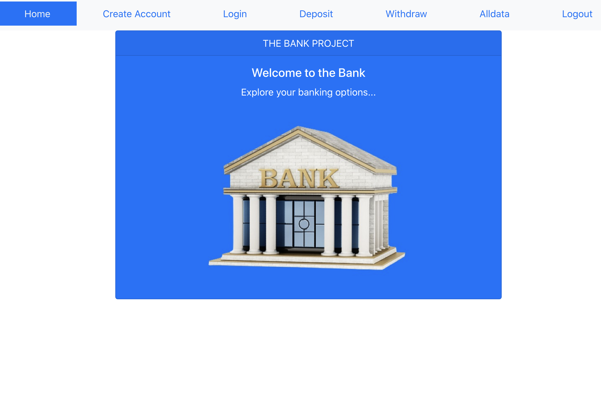

# The Bank project
  Simple Banking project to perform deposit, withdraw and balance checking.

**What I Learned**
- How to use react hooks useState,useEffect,useReduce,useContext
- How to use UserContext to pass data to multiple components.
- How to perform HashRouting and Link the Navigation of different pages
- Using bootstrap to create card and form components
- Deploying a react project in github

**react-bank-app**

## Description
- This project is designed using bootstrap card and form components.
- It used HashRouter to create Routes to different Navigational links.
- It also used UserContext and useContext to access User Data accross the different pages.
- This bank app has Home,Createaccount,Login,Deposit,Withdraw,Alldata and Logout pages.
- By default it's logged in as 'Admin' user who can visit all the pages and all the users data in 'Alldata' page.
- One can create new account using 'Createaccount' page and Login using 'Login' page.
- As soon as the user logged in he becomes active and he can perform deposit,withdraw actions and see the balance.
- The 'Alldata' page shows only the account details of the user who logged in.
- Once the user logged out the deposit,withdraw and alldata pages become disabled.
- Those pages will be enabled if the user goes to Home,Createaccount / Login pages as it enables the 'Admin' .

## Installation
- Download this project in your working directory through, \
git clone https://github.com/vanisbala/react-banking-app
- cd into the new folder and type
$ npm install
it will install the required dependencies.
- To run the react project
$ npm start
- You can explore the banking actions through this project.
- You can also modify the project to include new features.

**Demo**

## Built with
- [HTML](https://developer.mozilla.org/en-US/docs/Web/HTML)
- [CSS](https://developer.mozilla.org/en-US/docs/Web/CSS)
- [JavaScript](https://developer.mozilla.org/en-US/docs/Web/Javascript)
- [React](https://reactjs.org/)
- [Bootstrap](https://blog.getbootstrap.com/2020/12/07/bootstrap-5-beta-1/)

## Deployed Link
- [See live Site](https://vanisbala.github.io/react-bank-app/)

## Author
### Vani 
- [Link to Github](https://github.com/vanisbala)

## Credits
Thanks to MITxPRO for giving me the opportunity to work on this react banking project.
The wonderful MIT professors who always gives simple, easy to understand explanations for any complex topic,
- Abel Sanchez
- John Williams  

My gratitudes to our learning facilitators, for their guidance throughout the project.
- Carolina Barreiro
- Greg Lindeman
- Puneet Saraswat

